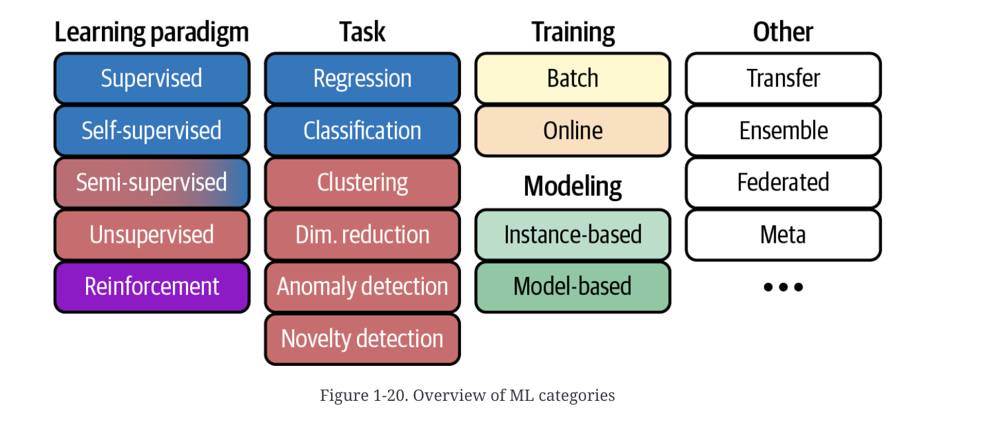

# hands-on-machine-learning

- Gitub repo with examples: https://github.com/ageron/handson-mlp

## The Machine Learning Landscape

### Types of Machine Learning Systems

#### Training Supervision

##### Unsupervised

- Visualization algorithms
- Dimensionality reduction
- Anomaly detection
- Novelty detection
- Assocation rule learning

##### Semi-supervised learning

- Most are combinations of supervised and unsupervised
    - Clustering algorithm may be used to group similar instances together, and then unlabeled instances can be labeled with the most common label in its cluster

##### Self-supervised learning

- Generate a fully labeled dataset from fully unlabeled one
- Once labeled, can use supervised learning
- `Transfer learning` is an important concept especially in DNNs

##### Reinforcement learning

- Learning system (agent) can observe enviroment, select and perform actions, and get rewards in return (or penalties)
- Must learning by itself what is the best strategy - called a `policy`

#### Batch Versus Online Learning

##### Batch Learning

- System trained using all available data
- Generally done "offline" (not making predictions)
- First system is trained and then enabled in production and runs w/o learning anymore
- Data drift (model rot)

##### Online Learning

- *Online refers to how the model is trained - not whether the system is online or offline*
- Train system incrementally by feeding it data instances sequentially, either individually or in small groups called `mini-batches`
- Most common online algorithm is `gradient descent`
- Also useful for very large dataset that cannot fit on one machine's memory 
- `Learning rate` - how fast system should adapt to changing data
- Instead of `online learning`, you can think of this as `incremental learning`, it doesn't need to be done on a live system

#### Instance-Based Versus Model-Based Learning

- Most machine learning tasks are about making predictions
- Two main approaches to generalize to make good predictions are `instance-based learning` and `model-based learning`

##### Instance-based learning

- Uses examples it was trained on to generalize to new cases by using a similiary measure to compare them to the learned examples
- Works well on small datasets but doesn't scale well
    - Requires deploying a whole copy of the training set to production - making predictions requries searching for similar instances which can be slow (doesn't work for high dimensional data)

##### Model-based learning and a typical machine learning workflow

- Building a model which is then used to make predictions
- Typically this is what you envision when thinking about machine learning
- `Model selection` - selecting a type of model for a given dataset and task
- How to determine performance?
    - `Utility function` - how **good** your model is
    - `Cost function` (aka `loss function`) that measures how **bad** it is

### Main Challenges of Machine Learning

- Bad data
- Bad model

#### Insufficient Quality of Training Data

#### Nonrepresentative Training Data

- Training data needs to be representative of the new cases you want to generalize to
- Sampling bias and sampling noise

#### Poor-Quality Data

- if data full of errors, outliers, and noise, it will be harder for system to detect underlying patterns, so system is less likely to perform well

#### Irrelevant Features

- 